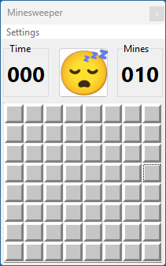
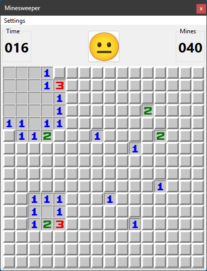
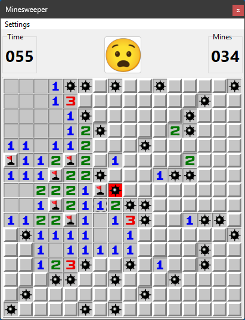

# Minesweeper

## Game Features

- **A grid-based game board**
  - Beginner (8x8, 15 mines)
  - Intermediate (16x16, 40 mines)
  - Expert (30x16, 99 mines)
  - Custom ([8..100]x[8..100], [1..9999] mines)
- **Randomly placed mines** on the first move excluding the first selected tile (first save move)
- **Number hints on tiles** indicating adjacent mines
- **Left-click to reveal a tile**, right-click to flag/question/unmark a potential mine
  - Left click on a flagged tile will do nothing
  - Left click on a questioned tile will reveal it
  - Left click on an revealed tile will
    - reveal all adjacent tiles if the adjacent flags equals the adjacent mines
    - shows unrevealed adjacent tiles as revealed (without the adjacent mines information)
- **Winning condition:** Reveal all non-mine tiles.
- **Losing condition:** Reveal a mine ends the game
- Tracks time

## Implementation details

- Separated game logic
- UI with VCL

## Screenshots

  
  
  
